# Скриншоты основных этапов развертывания отказоустойчивой инфраструктуры

1. Итог выполнения Terraform

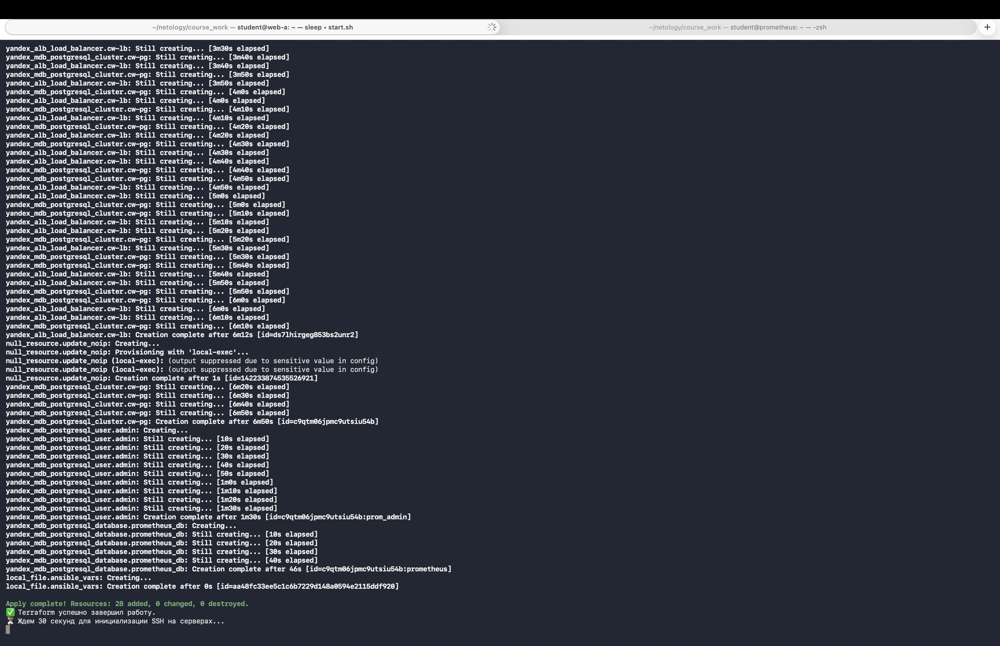

---

2. Выполнения Ansible

Выполнение плейбуков nginx и exporters

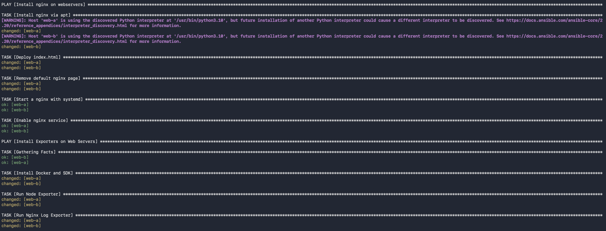

Выполнение плейбука prom

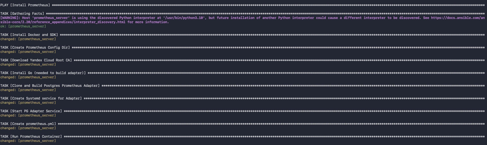

Выполнение плейбука grafana

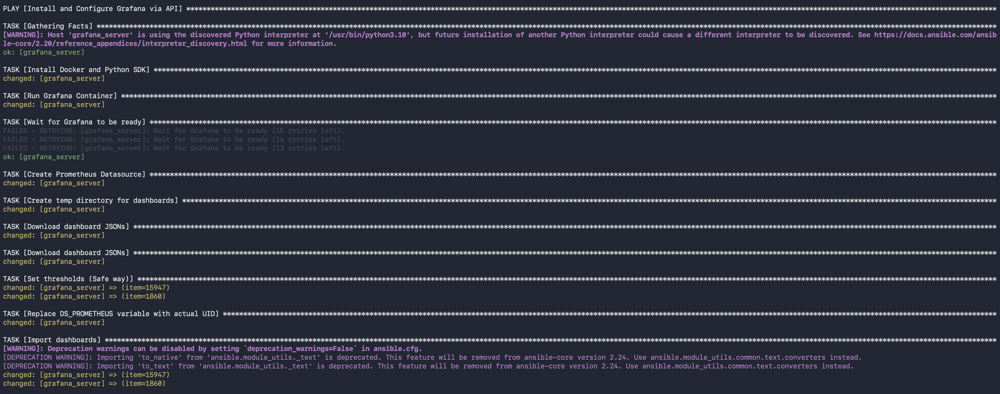

Выполнение плейбука kibana

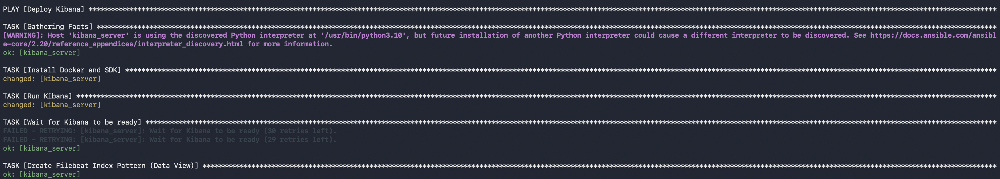

Выполнение плейбука es

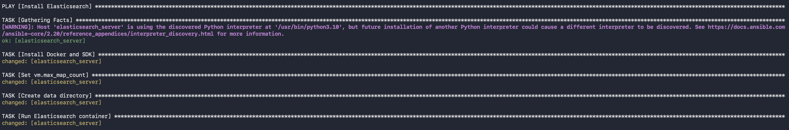

Выполнение плейбука filebeat_all

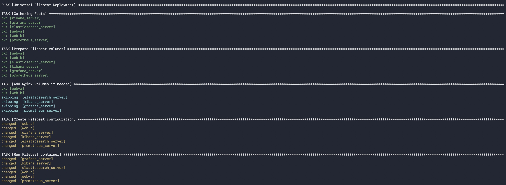

Выполнение плейбука snapshot

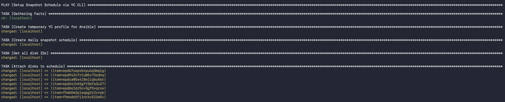

Итог выполнения мастер-плейбука site

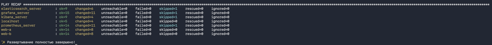

---

3. Скриншот раздела Compute Cloud в личном кабинете Yandex Cloud

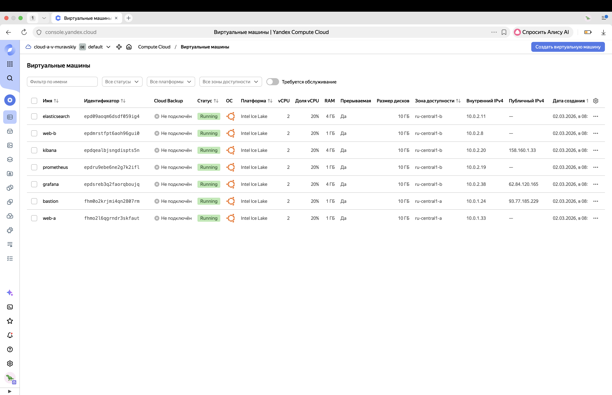

4. Скриншот раздела Virtual Private Cloud/Облачные сети в личном кабинете Yandex Cloud

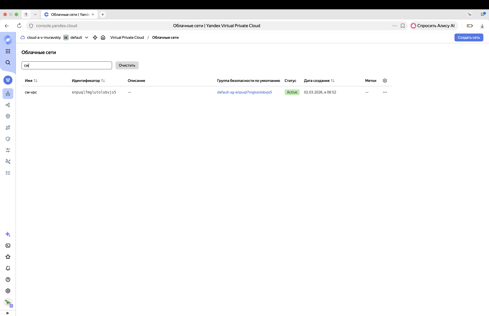

5. Скриншот раздела Virtual Private Cloud/Подсети в личном кабинете Yandex Cloud

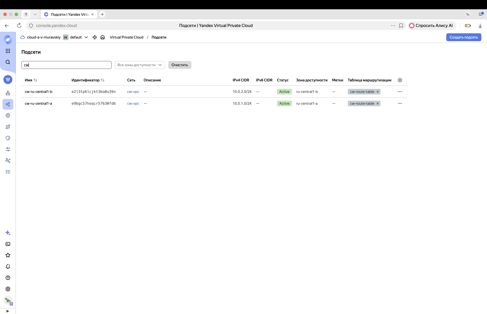

6. Скриншот раздела Application Load Balancer в личном кабинете Yandex Cloud

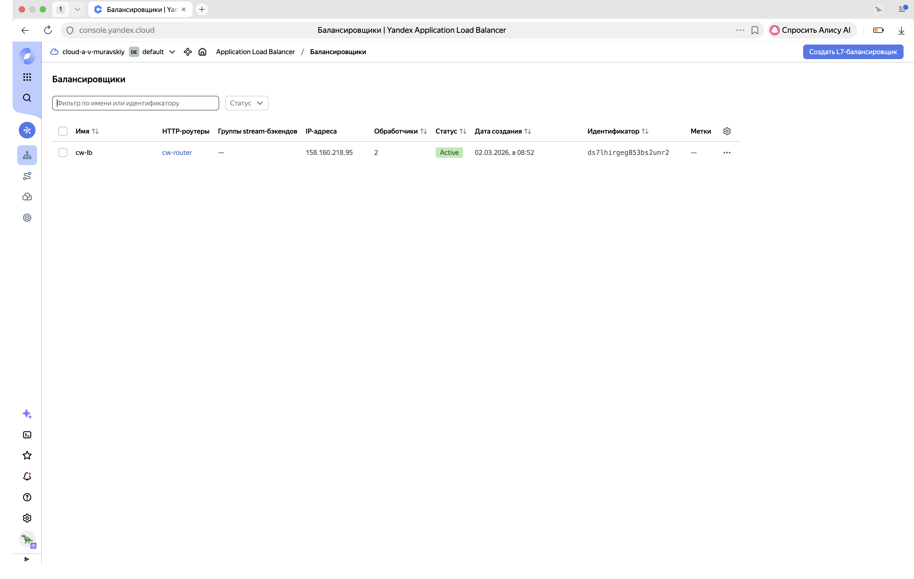

7. Скриншот главной страницы сайта

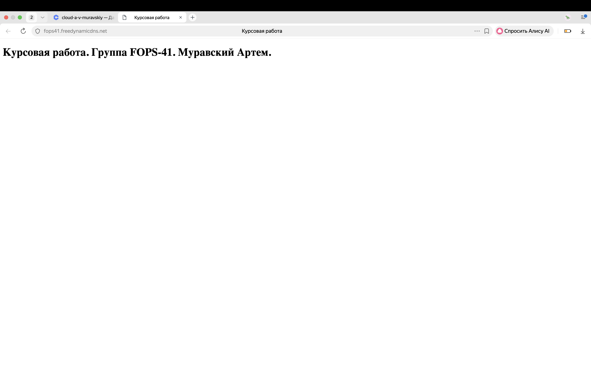

8. Скриншот личного кабинета сервиса регистрации доменов NoIp

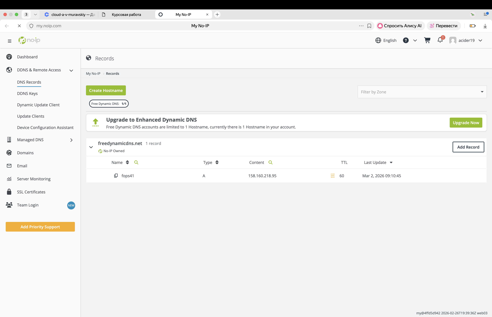

9. Скриншот web-ui Grafana

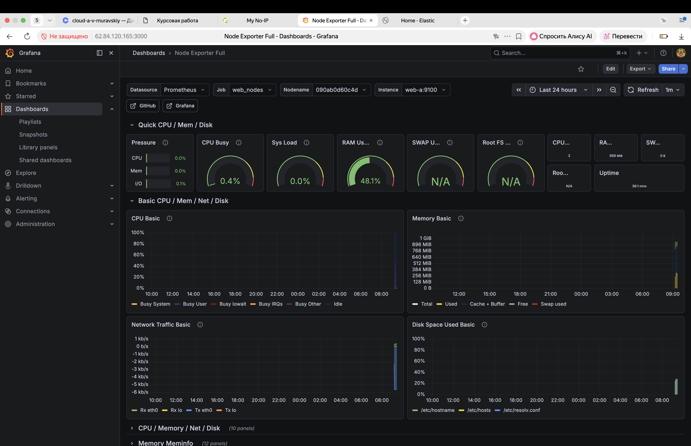

10. Скриншот web-ui Kibana

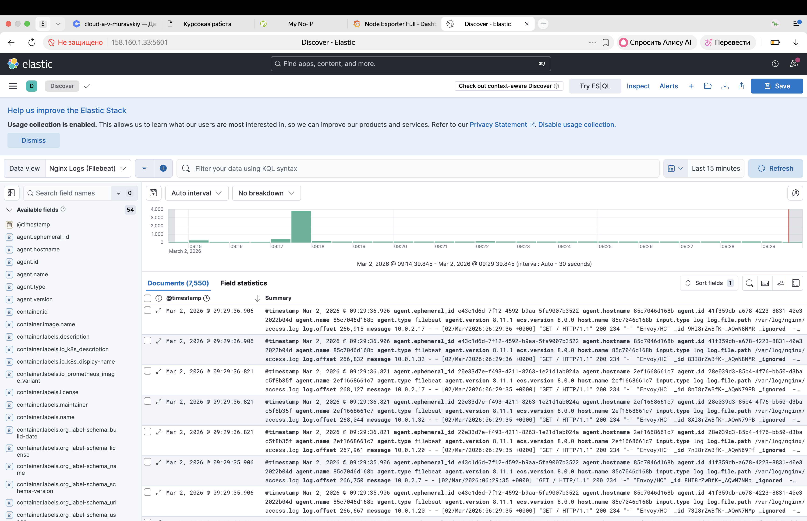

11. Скриншот вывода команды `docker ps -a` на ВМ web-a

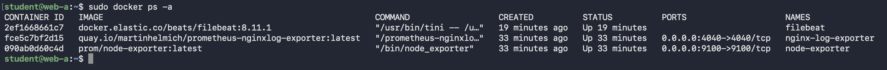

12. Скриншот вывода команды `docker ps -a` на ВМ web-b

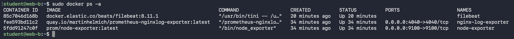

13. Скриншот вывода команды `docker ps -a` на ВМ prometheus

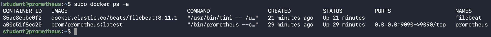

14. Скриншот вывода команды `docker ps -a` на ВМ grafana

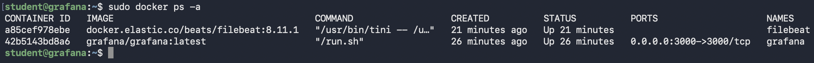

15. Скриншот вывода команды `docker ps -a` на ВМ elasticsearch

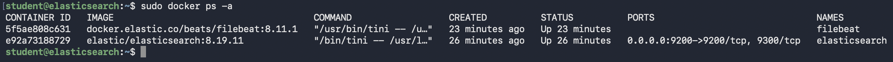

16. Скриншот вывода команды `docker ps -a` на ВМ kibana

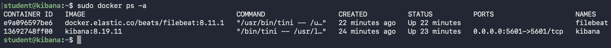
